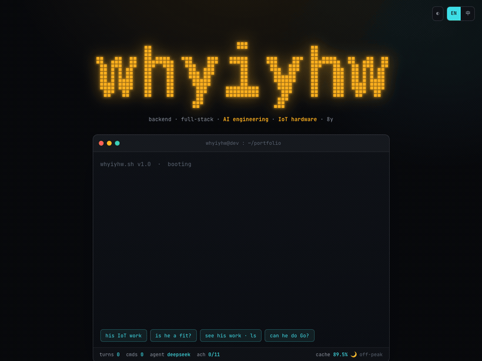

# agentcard — 会接待访客的 AI 终端名片

[](LICENSE)  

一张会替你**接待、筛选、转化**访客的 AI 名片。也是第一张能被别人的 agent 直接对话（**A2A**）的个人名片。

> **TL;DR** — An AI business card that greets, screens, and converts visitors for you.
> A playable terminal + streaming DeepSeek agent with real, server-gated tools
> (contact intake · gated WeChat · résumé delivery), a leads dashboard with Feishu
> alerts, a `curl` card, and **A2A** — so another agent can discover and talk to it.
> One `index.html` + one Cloudflare Worker. Fork, edit two files, `wrangler deploy`.

**Live demo:** [ask.whyiyhw.com](https://ask.whyiyhw.com) · 也试试 `curl ask.whyiyhw.com`



## 能做什么

- **可玩终端** — LED 点阵名字 + 启动动画 + 真命令行（`help`/`iot`/`ls`/`ask`…），深浅 / 中英切换，成就系统
- **流式 AI agent** — DeepSeek 代理（key 只在服务端），SSE 逐字上屏，多轮上下文；挂了自动回退脚本应答
- **4 个服务端门控的真工具** — 留联 / 微信（须先留联系方式）/ 一页简介 / 完整简历（邮箱四重门控发送）
- **线索后台 + 飞书通知** — 谁来了、聊了什么、有人想合作实时推送 + 每日日报；IP 只存哈希
- **curl 名片 + A2A** — `curl` 拿 ANSI 名片；别人的 agent 可 `GET /.well-known/agent-card.json` 发现并 `POST /a2a` 对话

## 玩法

本地：`python3 -m http.server 8080` → http://localhost:8080（或直接双击 `index.html`）。
终端命令：`help` · `whoami` · `skills` · `iot` · `ls` · `open seek` · `ask <问题>` · `theme` · `lang` · `clear`；支持 ↑/↓ 历史；`#demo` 自动演示。

## 结构

```
├── index.html          # 前端：内容 + 样式 + 终端引擎（自包含，改内容区）
├── worker/
│   ├── ai-proxy.js     # 引擎：AI 代理 / 工具 / 落库 / 后台 / 通知 / A2A（不用改）
│   ├── config.js       # ★ 内容：人设、事实基线、curl 名片、邮件模板、A2A 卡（改成你的）
│   ├── schema.sql      # D1 建表
│   ├── wrangler.toml.example  # 部署配置模板 → cp 成 wrangler.toml（真值本地，gitignore）
│   └── assets/         # 部署产物：index.html 副本 + brief.pdf + og.png
├── pdf-src/            # 合作简介 HTML 源（brief.html；完整简历源本地生成、不入库）
└── .claude/skills/agentcard-deploy/  # 让 Claude Code 带你部署的 skill（含设计理念）
```

## 部署（约十分钟）

> 最省事：在 Claude Code 里打开本仓库，触发内置 skill **`agentcard-deploy`**（说「部署这个项目」），它会访谈你逐步做完，并讲清设计理念与安全模型。手动如下：

0. **起手**：`cp worker/wrangler.toml.example worker/wrangler.toml` + `cp worker/.dev.vars.example worker/.dev.vars`
1. **改内容**：`worker/config.js`（人设、事实、域名、邮箱、curl 名片、A2A 卡）+ `index.html` 内容区 + `pdf-src/` 重出 PDF
2. **改配置**：`worker/wrangler.toml` — Worker 名、域名、`ALLOWED_ORIGINS`、通知渠道（`FEISHU_*` 或 slack/discord/ntfy）
3. **建库**：`npx wrangler d1 create ask-db` → 填 `database_id` → `npx wrangler d1 execute ask-db --remote --file=schema.sql`
4. **灌 secrets**：`DEEPSEEK_API_KEY`（必）· `ADMIN_TOKEN`（必）· `WECHAT_ID` / `MAILERSEND_API_KEY`（或 `RESEND_API_KEY`）/ `FEISHU_APP_SECRET`（按需）
5. **上线**：`./worker/deploy.sh`（同步前端 → `wrangler deploy`）

> **key 只在 Worker secret，永不进前端**（否则被盗刷）。防滥用：CORS 白名单 · 每 IP 10 次/分 · 问答各 ≤500 token。不绑 D1 也能跑——落库 / 通知全走 `waitUntil` 旁路。
> 发件域名验证（SPF/DKIM）、简历 PDF 重生成、本地联调（`wrangler dev` + `localStorage.ai_endpoint`）等细节 → 见 **`.claude/skills/agentcard-deploy/SKILL.md`**。

上线后：`https://<域名>/admin?t=<ADMIN_TOKEN>` 看会话 / 线索 / 回放；`…/admin/probe?t=…` 验证通知链路。

## Agent 工具

DeepSeek function calling，Worker 侧执行，终端里可见 `[agent] → xxx ✓`：

| 工具 | 触发 | 防线 |
|---|---|---|
| `leave_contact` | 访客留下联系方式 + 来意 | 落 `leads` + 推送通知 |
| `offer_wechat` | 访客要微信号 | **微信号存 secret，不进 prompt**；门控＝对方须已留联系方式；每会话最多 2 次 |
| `send_brief` | 访客想快速了解 | 返回 `/brief.pdf`（一页简介，人人可得） |
| `send_resume` | 访客诚心要简历 + 给了邮箱 | 发到对方邮箱。**四重门控**：邮箱须访客亲手敲的 · 同邮箱 7 天不重发 · 每会话 1 次 · 每日全局 ≤10。固定模板（无注入面），`Reply-To` 直达本人；链接带 token、7 天有效、**被打开时飞书推 🔥**（最热线索） |

## A2A：让别人的 agent 也能来递名片

- 发现：`GET /.well-known/agent-card.json`
- 对话：`POST /a2a`（JSON-RPC 2.0，`message/send`；带 `contextId` 自动续多轮，历史存 D1）

```bash
curl -s https://ask.whyiyhw.com/a2a -H 'content-type: application/json' -d '{
  "jsonrpc":"2.0","id":1,"method":"message/send",
  "params":{"message":{"role":"user","parts":[{"kind":"text","text":"is he a fit for an IoT gateway project?"}]}}
}'
```

## 自定义 / License

- 文案：`index.html` 内中英用 `<span class="zh">` / `<span class="en">`，语言标记用 `lang-en`（别用 `en`，会撞内容规则）。
- 配色：`:root` 的 CSS 变量（主色 `--amber`，次色 `--cyan`）。
- 静态托管：GitHub Pages（`main` / root）或 Cloudflare Pages（build 留空，输出 `/`）；AI 走上面的 Worker。

MIT © whyiyhw (Yi Xue) — see [LICENSE](LICENSE).
